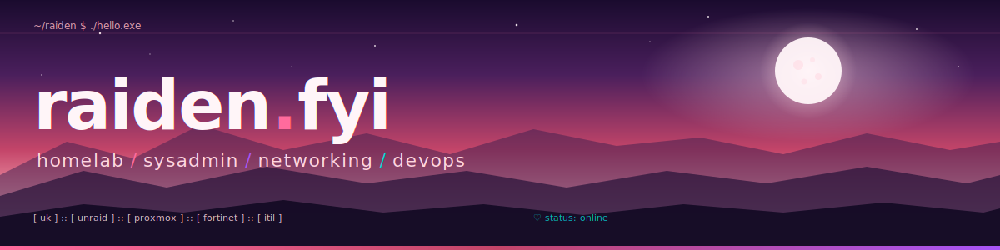

## 👋 Welcome

IT support & digital services background out of the UK. T-Level in Digital Support Services from Leeds City College, work placement as an Associate IT Service Manager at **DWP Digital**. Aspiring network security analyst / network engineer.

---

## 🛠️ Tech Stack

**Virtualisation & Homelab**

**Networking & Security**

**OS & Tooling**

**Process**

---

## 🚧 Currently Building

- **Unraid media stack** — Jellyfin, Sonarr, Radarr, Prowlarr, Jellyseerr, qBittorrent over VPN 
- **GPU passthrough** — RTX 3060 for media encoding
- **Hardware tinkering** — networking gear, laptop & desktop repairs, custom pc builds, homelab expansion

---

## 🏆 Awards & Experience

- 🎓 **Student of the Year: 2023/2024 & 2024/2025** — Leeds City College
- 💡 **Star Awards: Digital Visionary Award: 2024/2025** — Leeds City College
- 💼 IT Service Manager placement at **DWP Digital** Oct 2024 - Feb 2025
- 💼 Student Programme Delivery Intern placement at **Hundo** April 2024 - May 2024

---

## 📊 stats

---

built in a homelab, powered by too much late nights and music ⚡

